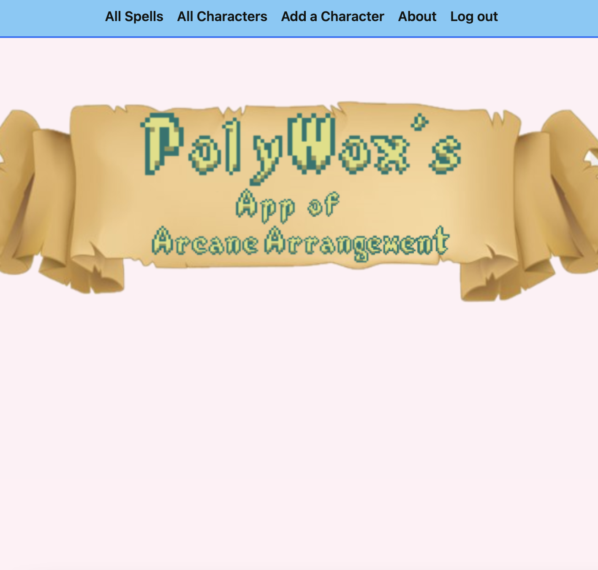
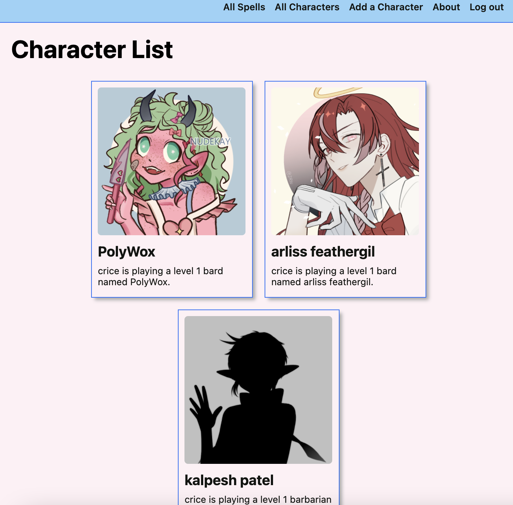
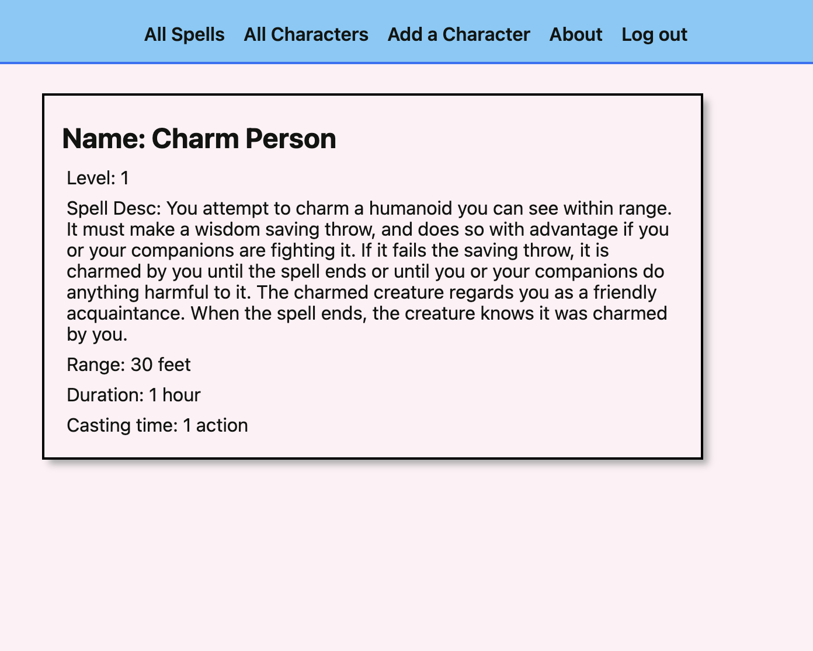

# PolyWox's App of<br>Arcane Arrangement

Create and upload image of your dnd characters and search for spells and see spell details for each spell

## why?
I love dnd and this is going to be an on going project to develop a better dnd app for personal use

# **Getting Started:**
[PolyWox's App of Arcane Arrangement](https://arcane-arrangement.herokuapp.com/)<br>
[Trello Board](https://trello.com/b/630wLSlx/arcane-arrangement)<br>


# **Screenshots:**



# **Technologies Used:**
dnd5eapi<br>python<br>Django<br>CSS<br>DTL<br>AWS S3

# **Next steps:** [icebox] 
- [x] upload an image using amazon s3 buckets
- [ ] add class features
- [ ] update spell slots
- [ ] add more spell details
# **Code Sample:**
template:
```django





<link 
  rel="stylesheet" 
  type="text/css" 
  href=""
/>
<script defer src=""></script>




<section class="character-container">
  <div class="character-img">
    
      
    
    
    
  </div>
  <div class="character-details">
    <h1>{{ character.name }}</h1>
    <p>{{ character.char_class }}</p>
    <p>{{ character.level }}</p>
     <div class="character-actions">
      <a href="" class="btn warn">Edit</a>
      <a href="" class="btn danger">Delete</a>
    </div>
     New markup below 
    <h3>Change {{ character.name }}'s photo</h3>
    <p id="file-name"></p>
    <form 
      action=""
      enctype="multipart/form-data"
      method="POST"
    >
      
      <label class="btn secondary">
        Choose photo
        <input type="file" name="photo-file" id="file-input">
      </label>
      <button type="submit" class="btn submit">Upload Photo</button>
    </form>
   New markup above 
  </div>
</section>
<section class="spells">
    <div class="subsection-title">
      <h2>Spells</h2>
      
    </div>
<h3>{{ character.name }}'s Learned Spells</h3>
    <div class="subsection-content">
      
        
          <div class="spell-container">
            <div 
              class="color-block"
             
            ></div>
            <a href="">
              <p> {{ spell.name }}</p>
            </a>
          </div>
        
      
        <p class="no-spells">{{character.name}} doesn't have any spells 😞</p>
      
    </div>
    <h3>Available Spells</h3>
    <div class="subsection-content">
       We'll display learned_spells here 
      
        
           <div class="spell-container">
            <div 
              class="color-block"
              
            ></div>
            <a href="">
              <p>{{ spell.name }}</p>
            </a>
            <form action="" method="post">
              
              <button type="submit" class="btn submit">Learn Spell</button>
            </form>
          </div>
        
      
        <p class="all-spells">
          {{character.name}} already has learned all the available spells 🥳
        </p>
      
      <form action= method="GET">
        <button type="submit" class="btn submit" >Search Spell</button>
      </form>
    </div>
  </section>
</div>
</div>

```
view:

```python
@login_required
def spell_details(request, spell_id):
 
  spell = Spell.objects.get(id=spell_id)
  response = requests.get(f"{API_BASE_URL}{spell.url}")
  spelldata = response.json()
  print(spelldata)
  return render(request, 'main_app/spell_detail.html', {
    "name": spelldata['name'], "level": spelldata['level'], 'desc': spelldata['desc'], 'range': spelldata['range'], 'duration': spelldata['duration'], 'casting_time': spelldata['casting_time'], 
  })
```

```python
class Spell(models.Model):
  name = models.CharField(max_length=250)
  url = models.CharField(max_length=250)

  def __str__(self):
    return self.name
  
  def get_absolute_url(self):
      return reverse("spells_detail", kwargs={"spell_id": self.id})
  

class Character(models.Model):
  player = models.ForeignKey(User, on_delete=models.CASCADE)
  name = models.CharField(max_length=50)
  char_class = models.CharField(max_length=9,
  choices=CLASS_CHOICE,
  default=CLASS_CHOICE[0][0]
  )
  level = models.IntegerField(
    default=1,
    validators=[MaxValueValidator(20), MinValueValidator(1)]
  )
  spell_list = models.ManyToManyField(Spell, blank=True)
  

  def __str__(self):
    return self.name

  def get_absolute_url(self):
      return reverse("characters_detail", kwargs={"character_id": self.id})
```
# **API Reference:**
http://www.dnd5eapi.co/docs
# **Credits:**
css inpired by [David Stinson](https://www.linkedin.com/in/david-stinson/)<br><br>
[Ben Manley](https://www.linkedin.com/in/benjamintmanley/)
<br>Aftin Combs for the icons<br>
[Blake Romano](https://www.linkedin.com/in/blakeromano/)
<br>[David Nagarpowers](https://www.linkedin.com/in/david-nagarpowers/)<br>
[Chitra Son](https://www.linkedin.com/in/chitrason/)
<br>[Nicholas Rodriguez](https://www.linkedin.com/in/nicholas-r-rodriguez/)
<br>
[Damien Rhodes](https://www.linkedin.com/in/damiencrhodes/)